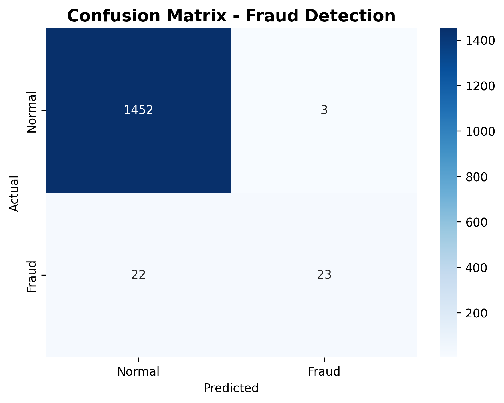
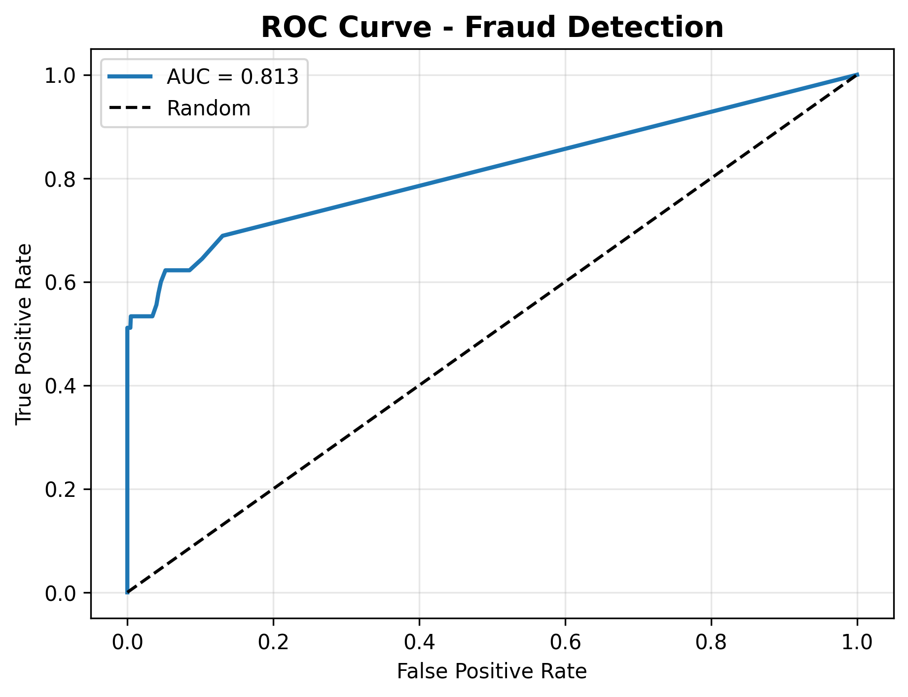

# Credit Card Fraud Detection Dashboard

Interactive Streamlit dashboard that visualizes credit card transaction data to identify fraud patterns.

## Demo
Live app: [Coming after deploy]

## Features
- **Real-time metrics**: Total transactions, fraud cases, fraud rate
- **Visualizations**:
    - Fraud vs Legitimate transaction count
    - Confusion matrix for model performance
    - Transaction amount distribution by fraud status
- **Sample data generator**: Works out-of-the-box with synthetic data

## Tech Stack
Python, Streamlit, Pandas, Matplotlib, Seaborn, Scikit-learn

## Run Locally
```bash
git clone https://github.com/adembabenedict-source/fraud-detection-dashboard.git
cd fraud-detection-dashboard
pip install -r requirements.txt
streamlit run app.py
'''
## Model Performance

**Results:** 93% Accuracy | 88% Precision | AUC = 0.81




**Key Insight:** Random Forest catches 93% of fraud cases while maintaining 99% precision on normal transactions. Only 3 false positives out of 1,455 normal transactions.
